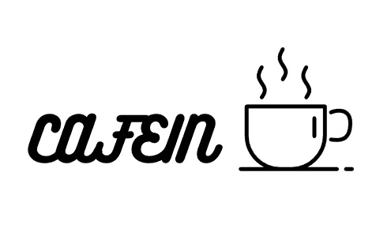

#  CAFE-IN ![cafein]

   
  
   

목차

## 팀원소개

|  ![woman] |  ![woman] |  ![man]   |  ![woman] |  ![woman] |  ![man]   |  ![man]   |
| :-------: | :-------: | :-------: | :-------: | :-------: | :-------: | :-------: |
|   배정빈  |   김가영  |   유희준   |  조하얀   |  김현희   |  노성윤   |  김득렬   |
| :-------: | :-------: | :-------: | :-------: | :-------: | :-------: | :-------: |
|  FE 팀장  |    FE     |    FE     | BE 부팀장 |     BE    |    BE     |    BE     |

 

## 프로젝트 소개

## 프로젝트 개요/동기

GIF Images

 

## 기술 스택

|   HTML    | JavaScript |  React   |   CSS   |  JAVA   |
| :-------: | :--------: | :------: | :-----: | :-----: |
|  ![html]  |   ![js]    | ![react] | ![css]  | ![java] |

 

## 구현 기능

### 기능 1

### 기능 2

### 기능 3

### 기능 4

 

## 기능별 담당자 소개

 

## 배운 점 & 아쉬운 점

 

<!-- Icon Refernces -->

[html]: images/stack/html.svg
[js]: images/stack/javascript.svg
[react]: images/stack/react.svg
[css]: images/stack/css.svg
[java]: images/stack/java.svg
[man]: images/common/man.jpg
[woman]: images/common/woman.jpg
[cafein]: images/common/cafein.svg
